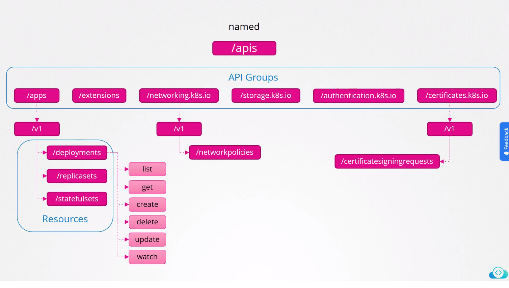

# ⚙️ Configurantion

Commands and Arguments in Docker

`docker run <image>`

`docker run <image> <command> <parameter>`


ENTRYPOINT is how the application starts


Commands and Arguments in K8S

<figure><figcaption></figcaption></figure>

Enviroment Variable

<figure><figcaption></figcaption></figure>

ConfigMaps

```
// literal
k create configmap <config-name> --from-literal=<key>=<value>
// from file
k create configmap <config-name> --from-file=app.config.properties
```

declarative way


```yaml
apiVersion: v1
kind: ConfigMap
metadata:
  name: app-config
data:
  APP_COLOR: blue
  APP_MODE: prod
```


```
k apply -f config-map.yaml
```

Inject ConfiMap Env Variable in a pod via `envFrom`

<figure><figcaption></figcaption></figure>

<figure><figcaption></figcaption></figure>

### Create Secrets

imperative way

using `--from-literal`

```
// Some code
kubectl create secret generic <secret-name> --from-literal=<key>=<value>
```

make a file as JSON `secret.properties`

```
// Some code
DB_HOST: mysql
DB_USER: root
DB_Password: paswrd
```

them use `--from-file`

```
// Some code
kubectl create secret generic <secret-name> --from-file=secret.properties
```

<figure><figcaption><p>Encode Scretes</p></figcaption></figure>

<figure><figcaption><p>Decode Secrets</p></figcaption></figure>

<figure><figcaption></figcaption></figure>


Secrets is not Encrypted! > use Encrypt at rest


<figure><figcaption></figcaption></figure>

Secrets are not encrypted, so it is not safer in that sense. However, some best practices around using secrets make it safer. As in best practices like:

* Not checking-in secret object definition files to source code repositories.
* [Enabling Encryption at Rest ](https://kubernetes.io/docs/tasks/administer-cluster/encrypt-data/)for Secrets so they are stored encrypted in ETCD.

Also the way kubernetes handles secrets. Such as:

* A secret is only sent to a node if a pod on that node requires it.
* Kubelet stores the secret into a tmpfs so that the secret is not written to disk storage.
* Once the Pod that depends on the secret is deleted, kubelet will delete its local copy of the secret data as well.

Read about the [protections ](https://kubernetes.io/docs/concepts/configuration/secret/#protections)and [risks](https://kubernetes.io/docs/concepts/configuration/secret/#risks) of using secrets [here](https://kubernetes.io/docs/concepts/configuration/secret/#risks)

Having said that, there are other better ways of handling sensitive data like passwords in Kubernetes, such as using tools like Helm Secrets, [HashiCorp Vault](https://www.vaultproject.io/). I hope to make a lecture on these in the future.
