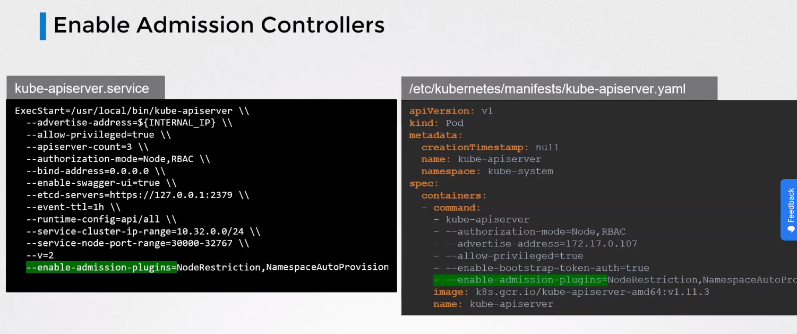

# ⚙️ Configurantion

Commands and Arguments in Docker

`docker run <image>`

`docker run <image> <command> <parameter>`


ENTRYPOINT is how the application starts


Commands and Arguments in K8S

<figure><figcaption></figcaption></figure>

Enviroment Variable

<figure><figcaption></figcaption></figure>

ConfigMaps

```
// literal
k create configmap <config-name> --from-literal=<key>=<value>
// from file
k create configmap <config-name> --from-file=app.config.properties
```

declarative way


```yaml
apiVersion: v1
kind: ConfigMap
metadata:
  name: app-config
data:
  APP_COLOR: blue
  APP_MODE: prod
```


```
k apply -f config-map.yaml
```

Inject ConfiMap Env Variable in a pod via `envFrom`

<figure><figcaption></figcaption></figure>

<figure><figcaption></figcaption></figure>
